# Análise dos Microdados do ENEM 2020

## 1. Objetivo do Projeto

Este projeto tem como objetivo realizar o processamento, modelagem e análise dos Microdados do ENEM 2020, utilizando um fluxo de ETL desenvolvido em Python/PySpark, modelagem dimensional em esquema estrela e armazenamento dos dados em um banco MySQL executado em container Docker.

A proposta do projeto é transformar a base bruta disponibilizada pelo INEP em um modelo analítico estruturado, permitindo a execução de consultas SQL, geração de indicadores, criação de visualizações gráficas e análise dos principais fatores relacionados ao desempenho dos participantes.

O projeto foi desenvolvido como parte de um teste técnico para a área de Análise de Dados, contemplando os seguintes pontos:

* Docker
* SQL
* Python
* PySpark
* Organização do código
* Documentação
* ETL
* Modelagem dimensional
* Esquema estrela
* Banco de dados MySQL
* Indicadores analíticos
* Visualizações gráficas
* Análise de correlação
* Análise socioeconômica

---

## 2. Base de Dados

A base utilizada corresponde aos Microdados do ENEM 2020.

Após o download e descompactação dos arquivos originais, o arquivo principal utilizado no processo de ETL é:

```text
microdados_enem_2020/DADOS/MICRODADOS_ENEM_2020.csv
```

No projeto, a base foi posicionada no diretório:

```text
data/MICRODADOS_ENEM_2020.csv
```

A documentação dos campos foi consultada a partir do dicionário de dados oficial disponibilizado junto aos microdados.

Por se tratar de uma base grande, o arquivo CSV não é versionado no GitHub. O diretório `data/` é utilizado apenas para execução local do projeto.

---

## 3. Tecnologias Utilizadas

As principais tecnologias utilizadas no projeto foram:

* Python
* PySpark
* MySQL
* Docker
* Docker Compose
* SQL
* Pandas
* Matplotlib
* SQLAlchemy
* PyMySQL
* PowerShell
* VS Code

Bibliotecas Python utilizadas:

```text
pandas
numpy
pyspark
sqlalchemy
pymysql
python-dotenv
matplotlib
seaborn
plotly
```

---

## 4. Estrutura do Projeto

A estrutura do projeto foi organizada da seguinte forma:

```text
Teste-Analista-de-Dados-SX/
├── README.md
├── requirements.txt
├── .gitignore
├── docker-compose.yml
├── data/
│   └── MICRODADOS_ENEM_2020.csv
├── sql/
│   ├── create_tables.sql
│   └── indicadores.sql
├── etl/
│   ├── main.py
│   ├── spark_session.py
│   ├── extract.py
│   ├── transform.py
│   ├── load.py
│   └── visualizacoes.py
├── outputs/
│   ├── correlacao_notas.png
│   ├── distribuicao_nota_media.png
│   ├── media_por_dependencia_escola.png
│   ├── media_por_disciplina.png
│   ├── media_por_faixa_etaria.png
│   ├── media_por_internet_q025.png
│   ├── media_por_raca.png
│   ├── media_por_renda_q006.png
│   ├── media_por_sexo.png
│   ├── media_por_uf_prova.png
│   └── redacao_por_status.png
├── notebooks/
└── dashboard/
```

### Descrição dos principais diretórios

| Diretório    | Descrição                                                                                                |
| ------------ | -------------------------------------------------------------------------------------------------------- |
| `data/`      | Armazena a base bruta do ENEM 2020 para execução local.                                                  |
| `etl/`       | Contém os scripts responsáveis pela extração, transformação, carga e geração de visualizações.           |
| `sql/`       | Contém os scripts de criação das tabelas e consultas de indicadores.                                     |
| `outputs/`   | Contém os arquivos gerados para análise, incluindo gráficos e bases agregadas.                           |
| `notebooks/` | Diretório reservado para análises exploratórias, caso necessário.                                        |
| `dashboard/` | Diretório reservado para arquivos de dashboard, caso seja utilizado Power BI, Excel ou outra ferramenta. |

---

## 5. Ambiente com Docker

O banco de dados MySQL é executado em um container Docker.

Arquivo `docker-compose.yml`:

```yaml
services:
  mysql:
    image: mysql:8.0
    container_name: enem_mysql
    restart: always
    environment:
      MYSQL_ROOT_PASSWORD: root
      MYSQL_DATABASE: enem_dw
    ports:
      - "3308:3306"
    volumes:
      - mysql_data:/var/lib/mysql

volumes:
  mysql_data:
```

A porta externa utilizada foi `3308`, pois as portas `3306` e `3307` já estavam ocupadas no ambiente local.

Para subir o container:

```powershell
docker compose up -d
```

Para validar se o container está em execução:

```powershell
docker ps
```

Para acessar o MySQL dentro do container:

```powershell
docker exec -it enem_mysql mysql -uroot -proot
```

---

## 6. Banco de Dados

O banco utilizado no projeto é:

```text
enem_dw
```

As tabelas criadas no banco são:

```text
dim_candidato
dim_escola
dim_local_prova
dim_socioeconomica
fato_resultados
```

O script de criação das tabelas está localizado em:

```text
sql/create_tables.sql
```

Para criar ou recriar as tabelas:

```powershell
Get-Content .\sql\create_tables.sql | docker exec -i enem_mysql mysql -uroot -proot enem_dw
```

---

## 7. Modelagem Dimensional

Foi adotado um modelo dimensional em esquema estrela, com uma tabela fato central e dimensões auxiliares.

### Tabela fato

A tabela fato principal é:

```text
fato_resultados
```

Essa tabela concentra os dados de desempenho dos participantes, incluindo:

* Chave do candidato
* Chave da escola
* Chave do local de prova
* Chave socioeconômica
* Presença nas provas
* Códigos das provas
* Notas por área de conhecimento
* Notas da redação
* Nota total
* Nota média
* Flag de ausência
* Flag de eliminação

### Tabelas dimensão

As dimensões criadas foram:

```text
dim_candidato
dim_escola
dim_local_prova
dim_socioeconomica
```

### Modelo lógico

```text
dim_candidato       ┐
dim_escola          ├── fato_resultados
dim_local_prova     ┤
dim_socioeconomica  ┘
```

---

## 8. Descrição das Tabelas

### 8.1 dim_candidato

A dimensão `dim_candidato` armazena informações cadastrais e demográficas dos participantes.

Principais campos:

* `sk_candidato`
* `nu_inscricao`
* `nu_ano`
* `tp_faixa_etaria`
* `ds_faixa_etaria`
* `tp_sexo`
* `ds_sexo`
* `tp_estado_civil`
* `tp_cor_raca`
* `ds_cor_raca`
* `tp_nacionalidade`
* `tp_st_conclusao`
* `tp_ano_concluiu`
* `tp_escola`
* `tp_ensino`
* `in_treineiro`

### 8.2 dim_escola

A dimensão `dim_escola` armazena informações disponíveis sobre a escola vinculada ao participante.

Principais campos:

* `sk_escola`
* `co_municipio_esc`
* `no_municipio_esc`
* `co_uf_esc`
* `sg_uf_esc`
* `tp_dependencia_adm_esc`
* `ds_dependencia_adm_esc`
* `tp_localizacao_esc`
* `ds_localizacao_esc`
* `tp_sit_func_esc`
* `ds_sit_func_esc`

### 8.3 dim_local_prova

A dimensão `dim_local_prova` armazena informações do município e UF onde o participante realizou a prova.

Principais campos:

* `sk_local_prova`
* `co_municipio_prova`
* `no_municipio_prova`
* `co_uf_prova`
* `sg_uf_prova`

### 8.4 dim_socioeconomica

A dimensão `dim_socioeconomica` armazena as respostas do questionário socioeconômico.

Campos utilizados:

```text
Q001 até Q025
```

No modelo final, esses campos foram padronizados como:

```text
q001 até q025
```

### 8.5 fato_resultados

A tabela fato `fato_resultados` armazena as informações de desempenho dos participantes.

Principais campos:

* `sk_resultado`
* `sk_candidato`
* `sk_escola`
* `sk_local_prova`
* `sk_socioeconomica`
* `tp_presenca_cn`
* `tp_presenca_ch`
* `tp_presenca_lc`
* `tp_presenca_mt`
* `nu_nota_cn`
* `nu_nota_ch`
* `nu_nota_lc`
* `nu_nota_mt`
* `nu_nota_redacao`
* `nota_total`
* `nota_media`
* `fl_ausente`
* `fl_eliminado`

---

## 9. Observação Sobre a Dimensão Escola

Durante a análise do dicionário de dados, foi identificado que a base dos Microdados do ENEM 2020 utilizada neste projeto não possui um identificador individual de escola, como `CO_ESCOLA`.

Por esse motivo, a dimensão escola foi modelada a partir dos campos disponíveis relacionados à escola do participante:

```text
CO_MUNICIPIO_ESC
NO_MUNICIPIO_ESC
CO_UF_ESC
SG_UF_ESC
TP_DEPENDENCIA_ADM_ESC
TP_LOCALIZACAO_ESC
TP_SIT_FUNC_ESC
```

Dessa forma, a análise de escola é feita por agrupamento de características escolares, como município, UF, dependência administrativa, localização e situação de funcionamento.

Portanto, a pergunta "Qual a escola com a maior média de notas?" foi adaptada para responder qual agrupamento escolar possui a maior média de notas, considerando os campos disponíveis na base.

---

## 10. Processo de ETL

O processo de ETL foi dividido em três etapas principais:

```text
Extração
Transformação
Carga
```

---

## 11. Extração

A extração é feita a partir do arquivo CSV dos Microdados do ENEM 2020.

Arquivo responsável:

```text
etl/extract.py
```

A leitura considera:

* Cabeçalho
* Separador `;`
* Encoding `ISO-8859-1`
* Inferência de schema

O arquivo CSV é lido pelo PySpark e transformado em um DataFrame para processamento distribuído.

---

## 12. Transformação

A transformação é realizada no arquivo:

```text
etl/transform.py
```

As principais transformações realizadas são:

* Seleção das colunas necessárias
* Padronização dos nomes das colunas
* Conversão dos tipos de dados
* Tratamento de valores nulos
* Criação de descrições para campos categóricos
* Criação das dimensões
* Criação da tabela fato
* Cálculo da nota total
* Cálculo da nota média
* Criação da flag de ausência
* Criação da flag de eliminação
* Geração de surrogate keys por hash determinístico

---

## 13. Carga

A carga é realizada no arquivo:

```text
etl/load.py
```

Os dados são carregados no MySQL por meio de conexão JDBC.

A ordem de carga respeita a estrutura dimensional:

```text
1. dim_candidato
2. dim_escola
3. dim_local_prova
4. dim_socioeconomica
5. fato_resultados
```

As dimensões são carregadas antes da tabela fato para garantir a integridade referencial das chaves estrangeiras.

---

## 14. Tratamento de Dados

Durante o processo de transformação, foram aplicadas regras para manter a consistência dos dados e evitar distorções nos indicadores.

### 14.1 Notas

As notas nulas foram mantidas como nulas para não distorcer os cálculos de média.

A `nota_total` e a `nota_media` são calculadas apenas quando todas as quatro notas objetivas estão disponíveis:

```text
NU_NOTA_CN
NU_NOTA_CH
NU_NOTA_LC
NU_NOTA_MT
```

A redação é analisada separadamente por meio do campo:

```text
NU_NOTA_REDACAO
```

### 14.2 Ausentes

Foi criada a flag:

```text
fl_ausente
```

Um participante é considerado ausente quando possui valor `0` em pelo menos um dos campos de presença:

```text
TP_PRESENCA_CN
TP_PRESENCA_CH
TP_PRESENCA_LC
TP_PRESENCA_MT
```

### 14.3 Eliminados

Foi criada a flag:

```text
fl_eliminado
```

Um participante é considerado eliminado quando possui valor `2` em pelo menos um dos campos de presença.

### 14.4 Questionário socioeconômico

Os campos do questionário socioeconômico foram tratados da seguinte forma:

* Respostas nulas em campos categóricos foram substituídas por `Z`.
* O campo `Q005`, por ser numérico, recebeu `0` quando nulo.

Campos utilizados:

```text
Q001 até Q025
```

---

## 15. Otimização do Processamento

Durante os testes com a base completa, foi identificado erro de memória no Spark:

```text
java.lang.OutOfMemoryError: Java heap space
```

A causa principal estava relacionada ao uso de janelas com ordenação global para geração de surrogate keys:

```text
Window.orderBy(...)
row_number()
```

Esse processo exigia ordenação de milhões de registros e causava alto consumo de memória.

Para reduzir esse problema, a geração das chaves substitutas foi alterada para uma estratégia baseada em hash determinístico com `xxhash64`.

As chaves das dimensões foram alteradas para o tipo `BIGINT` no MySQL para suportar os valores gerados por hash.

---

## 16. Execução com Amostra

Devido ao volume da base completa e às limitações de tempo e processamento no ambiente local, a execução final do ETL foi realizada com uma amostra de 50.000 registros dos Microdados do ENEM 2020.

A modelagem dimensional, o processo de ETL, as transformações e as consultas SQL foram desenvolvidas para suportar a base completa. A amostra foi utilizada para validar o fluxo completo de ingestão, transformação, carga, análise e geração de visualizações dentro do prazo disponível.

Configuração utilizada no arquivo `etl/main.py`:

```python
USAR_AMOSTRA = True
QTD_AMOSTRA = 50000
```

---

## 17. Como Executar o Projeto

### 17.1 Subir o container MySQL

```powershell
docker compose up -d
```

### 17.2 Ativar o ambiente virtual Python

```powershell
.\.venv\Scripts\Activate.ps1
```

### 17.3 Configurar o Hadoop no PowerShell

```powershell
$env:HADOOP_HOME="C:/hadoop"
$env:PATH="C:/hadoop/bin;$env:PATH"
```

### 17.4 Criar as tabelas no MySQL

```powershell
Get-Content .\sql\create_tables.sql | docker exec -i enem_mysql mysql -uroot -proot enem_dw
```

### 17.5 Executar o ETL

```powershell
python etl/main.py
```

### 17.6 Executar os indicadores SQL

```powershell
Get-Content .\sql\indicadores.sql | docker exec -i enem_mysql mysql -uroot -proot --table enem_dw | Out-File -Encoding utf8 resultados_indicadores.txt
```

### 17.7 Gerar as visualizações

```powershell
python etl/visualizacoes.py
```

---

## 18. Validação da Carga

Após a execução do ETL com amostra de 50.000 registros, foi realizada a validação das tabelas carregadas no MySQL.

Consulta utilizada:

```powershell
docker exec -it enem_mysql mysql -uroot -proot -e "USE enem_dw; SELECT 'dim_candidato' AS tabela, COUNT(*) AS total FROM dim_candidato UNION ALL SELECT 'dim_escola', COUNT(*) FROM dim_escola UNION ALL SELECT 'dim_local_prova', COUNT(*) FROM dim_local_prova UNION ALL SELECT 'dim_socioeconomica', COUNT(*) FROM dim_socioeconomica UNION ALL SELECT 'fato_resultados', COUNT(*) FROM fato_resultados;"
```

Resultado da validação:

```text
+--------------------+-------+
| tabela             | total |
+--------------------+-------+
| dim_candidato      | 50000 |
| dim_escola         | 2487  |
| dim_local_prova    | 1700  |
| dim_socioeconomica | 43558 |
| fato_resultados    | 50000 |
+--------------------+-------+
```

A tabela fato foi carregada com o mesmo volume da dimensão candidato, confirmando que os registros principais da amostra foram processados corretamente.

As demais dimensões possuem menos registros porque representam agrupamentos distintos de informações, como escolas, locais de prova e perfis socioeconômicos.

---

## 19. Indicadores SQL

Os indicadores foram organizados no arquivo:

```text
sql/indicadores.sql
```

As consultas SQL foram desenvolvidas para responder às principais perguntas do desafio técnico.

Indicadores contemplados:

1. Agrupamento escolar com maior média de notas
2. Aluno com maior média de notas e respectiva média
3. Média geral
4. Percentual de ausentes
5. Número total de inscritos
6. Média por disciplina
7. Média por sexo
8. Média por etnia/cor-raça
9. Média por faixa etária
10. Média por dependência administrativa da escola

Para executar os indicadores:

```powershell
Get-Content .\sql\indicadores.sql | docker exec -i enem_mysql mysql -uroot -proot --table enem_dw
```

Para salvar os resultados em arquivo:

```powershell
Get-Content .\sql\indicadores.sql | docker exec -i enem_mysql mysql -uroot -proot --table enem_dw | Out-File -Encoding utf8 resultados_indicadores.txt
```

O resultado final das consultas foi salvo no arquivo:

```text
resultados_indicadores.txt
```

---

## 20. Visualizações Geradas

Após a carga da amostra de 50.000 registros no MySQL, foram geradas bases agregadas e visualizações gráficas a partir das consultas realizadas sobre o modelo dimensional.

As visualizações foram geradas por meio do script:

```text
etl/visualizacoes.py
```

Os arquivos finais foram salvos no diretório:

```text
outputs/
```

### Visualizações disponíveis

| Visualização                                   | Arquivo                                    |
| ---------------------------------------------- | ------------------------------------------ |
| Correlação entre notas                         | `outputs/correlacao_notas.png`             |
| Distribuição da nota média                     | `outputs/distribuicao_nota_media.png`      |
| Média por dependência administrativa da escola | `outputs/media_por_dependencia_escola.png` |
| Média por disciplina                           | `outputs/media_por_disciplina.png`         |
| Média por faixa etária                         | `outputs/media_por_faixa_etaria.png`       |
| Média por acesso à internet                    | `outputs/media_por_internet_q025.png`      |
| Média por cor/raça                             | `outputs/media_por_raca.png`               |
| Média por renda familiar                       | `outputs/media_por_renda_q006.png`         |
| Média por sexo                                 | `outputs/media_por_sexo.png`               |
| Média por UF da prova                          | `outputs/media_por_uf_prova.png`           |
| Status da redação                              | `outputs/redacao_por_status.png`           |

---

## 21. Gráficos

### 21.1 Correlação entre notas

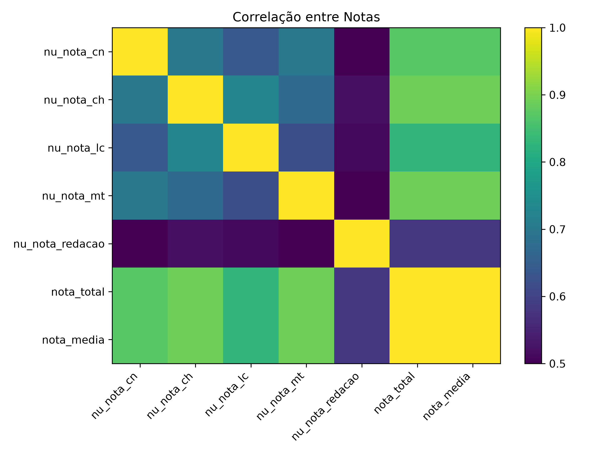

### 21.2 Distribuição da nota média

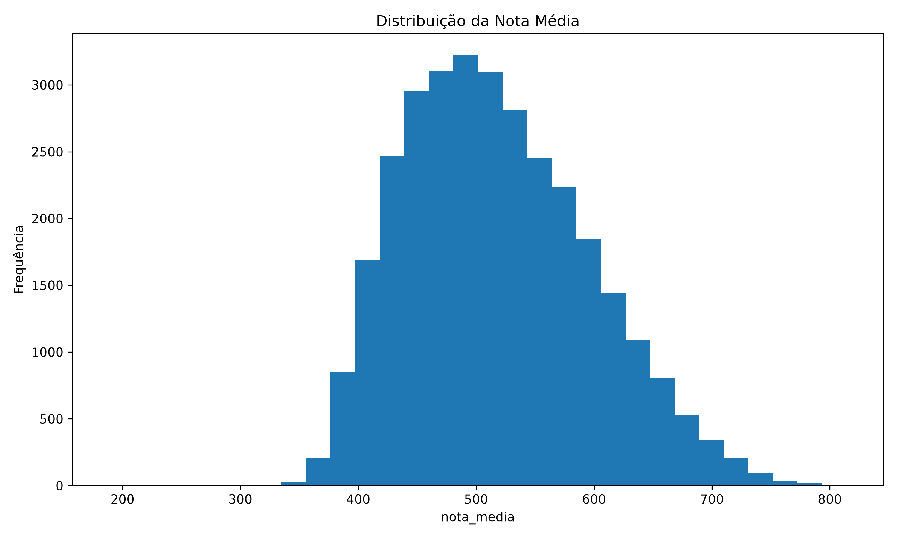

### 21.3 Média por dependência administrativa da escola

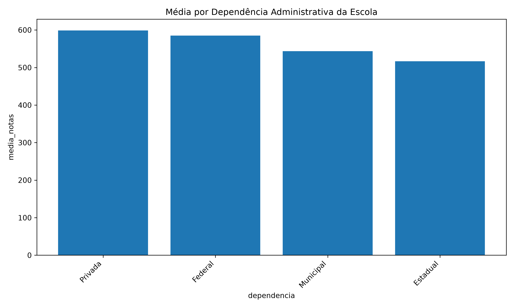

### 21.4 Média por disciplina

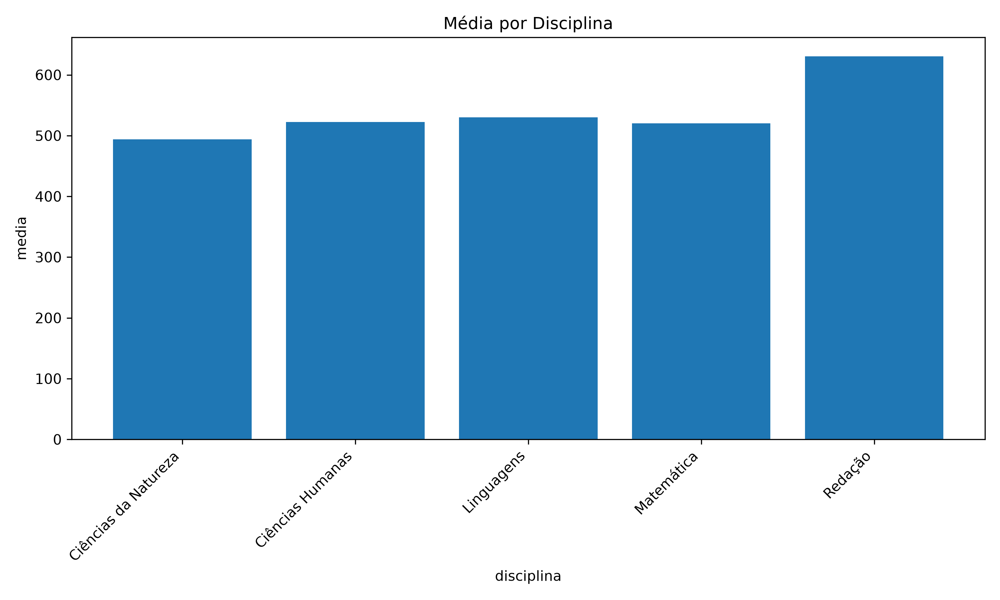

### 21.5 Média por faixa etária

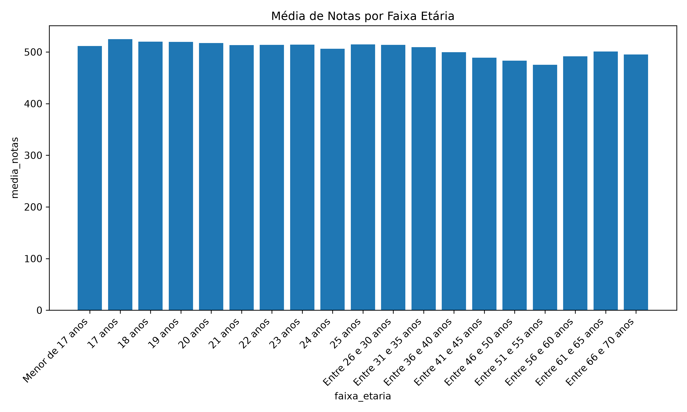

### 21.6 Média por acesso à internet

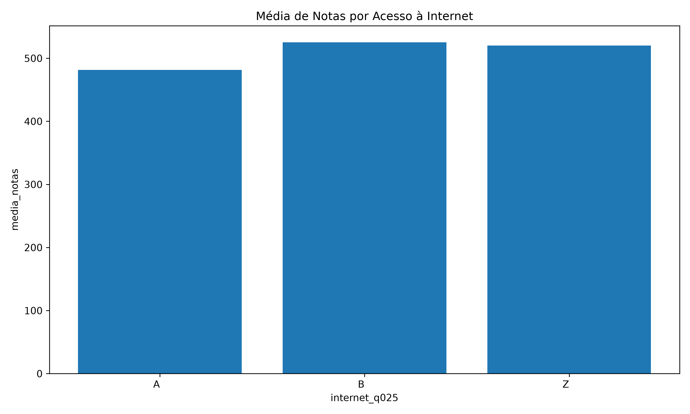

### 21.7 Média por cor/raça

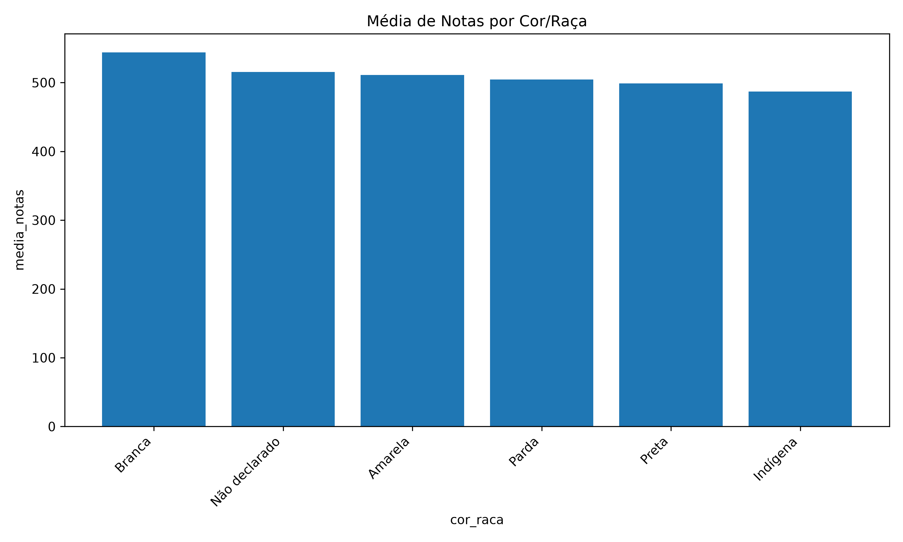

### 21.8 Média por renda familiar

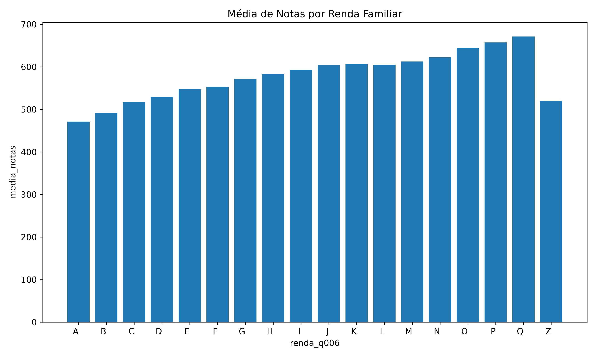

### 21.9 Média por sexo

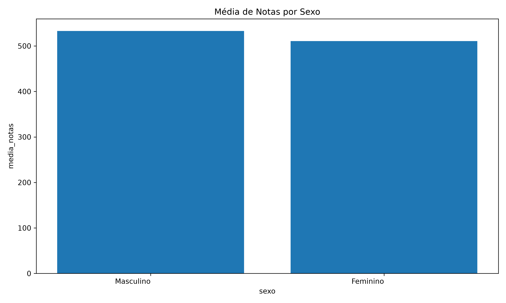

### 21.10 Média por UF da prova

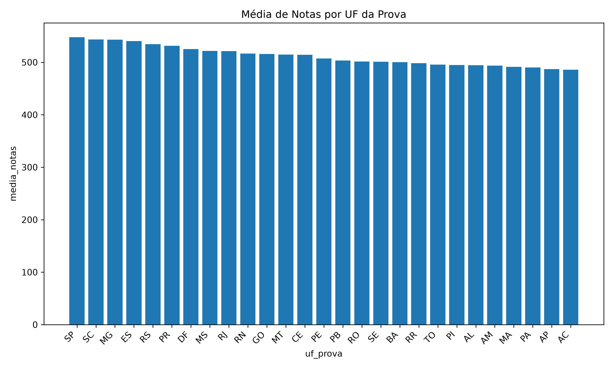

### 21.11 Status da redação

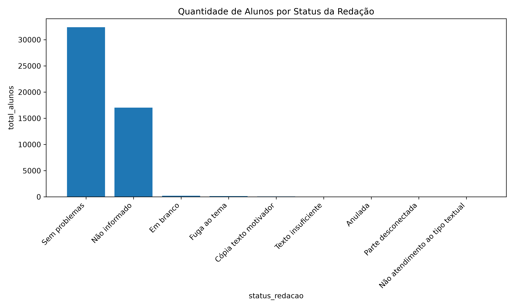

---

## 22. Dashboard Analítico

Foi desenvolvido um dashboard em Power BI para visualização dos principais indicadores do projeto.

O arquivo está disponível em:

text
dashboard/Dashboard_Analise_Regiao_escolas_alunos_enem.pbix

## 23. Análise de Correlação

Foi gerada uma matriz de correlação entre as principais notas disponíveis na tabela fato:

* Nota de Ciências da Natureza
* Nota de Ciências Humanas
* Nota de Linguagens e Códigos
* Nota de Matemática
* Nota de Redação
* Nota total
* Nota média

O arquivo gerado foi:

```text
outputs/correlacao_notas.png
```

Também foi gerada a base tabular da correlação:

```text
outputs/correlacao_notas.csv
```

A análise de correlação permite observar a relação entre o desempenho nas diferentes áreas de conhecimento e a composição da nota total.

---

## 24. Análise Socioeconômica

A dimensão socioeconômica foi utilizada para analisar a relação entre fatores do questionário socioeconômico e o desempenho dos participantes.

Foram geradas visualizações considerando:

* Renda familiar, por meio do campo `Q006`
* Acesso à internet, por meio do campo `Q025`

Arquivos gerados:

```text
outputs/media_por_renda_q006.png
outputs/media_por_internet_q025.png
```

Essa análise permite observar diferenças de desempenho associadas a condições socioeconômicas dos participantes.

---

## 25. Análise da Redação

A análise da redação foi realizada com base nos campos de nota e status da redação.

Campos utilizados:

```text
TP_STATUS_REDACAO
NU_NOTA_REDACAO
NU_NOTA_COMP1
NU_NOTA_COMP2
NU_NOTA_COMP3
NU_NOTA_COMP4
NU_NOTA_COMP5
```

Foi gerado o gráfico de quantidade de alunos por status da redação:

```text
outputs/redacao_por_status.png
```

Essa visualização permite avaliar a distribuição dos participantes de acordo com a situação da redação.

---

## 26. Conclusões e Insights

A partir da amostra processada de 50.000 registros dos Microdados do ENEM 2020, foram obtidos os seguintes insights:

1. A modelagem dimensional permitiu organizar os dados em uma estrutura analítica adequada para consultas SQL, geração de indicadores e criação de visualizações.

2. A tabela fato `fato_resultados` concentrou corretamente os dados de desempenho dos candidatos, possibilitando análises por diferentes dimensões.

3. A dimensão candidato permitiu analisar o desempenho por características como sexo, faixa etária e cor/raça.

4. A dimensão escola permitiu analisar o desempenho considerando município, UF, dependência administrativa, localização e situação de funcionamento da escola.

5. A ausência de um identificador individual de escola na base exigiu a adaptação da análise para agrupamentos escolares, mantendo coerência com os campos disponíveis no dicionário de dados.

6. As notas nulas foram mantidas como nulas, evitando distorções nos cálculos de média e preservando a qualidade analítica.

7. A criação das flags `fl_ausente` e `fl_eliminado` facilitou a análise de presença, ausência e eliminação dos participantes.

8. A análise por disciplina permite comparar o desempenho médio entre Ciências da Natureza, Ciências Humanas, Linguagens, Matemática e Redação.

9. A análise por sexo, cor/raça e faixa etária permite observar diferenças de desempenho entre grupos de participantes.

10. A análise por dependência administrativa da escola permite comparar o desempenho médio entre escolas federais, estaduais, municipais e privadas, conforme os campos disponíveis na base.

11. A análise socioeconômica permite observar diferenças de desempenho associadas a fatores como renda familiar e acesso à internet.

12. A matriz de correlação entre notas permite identificar relações entre o desempenho nas diferentes áreas de conhecimento e a nota total.

13. O uso de PySpark foi adequado para estruturar o processamento de uma base de grande volume, mesmo que a execução final tenha sido feita com amostra devido às limitações do ambiente local.

14. A utilização do MySQL em Docker facilitou a padronização do ambiente e a persistência dos dados em um banco relacional.

15. A separação do projeto em scripts de extração, transformação, carga, SQL e visualização contribuiu para melhor organização, manutenção e reprodutibilidade da solução.

---

## 27. Limitações

A principal limitação do projeto foi a execução em ambiente local, com restrição de memória e tempo de processamento.

Durante os testes com a base completa, foi identificado erro de memória no Spark:

```text
java.lang.OutOfMemoryError: Java heap space
```

Para contornar esse problema dentro do prazo de entrega, a execução final foi realizada com uma amostra de 50.000 registros.

Apesar disso, a arquitetura do projeto foi desenvolvida para suportar a base completa, desde que executada em ambiente com maior capacidade computacional.

Outra limitação identificada foi a ausência de um identificador individual de escola na base utilizada. Por esse motivo, a análise escolar foi realizada por agrupamentos de campos disponíveis relacionados à escola.

---

## 28. Reprodutibilidade

Para reproduzir a execução final, é necessário:

1. Instalar Docker e Docker Compose
2. Ter Python configurado
3. Instalar as dependências do projeto
4. Disponibilizar o arquivo `MICRODADOS_ENEM_2020.csv` no diretório `data/`
5. Subir o container MySQL
6. Criar as tabelas
7. Executar o ETL
8. Executar os indicadores
9. Gerar as visualizações

Comandos principais:

```powershell
docker compose up -d
```

```powershell
.\.venv\Scripts\Activate.ps1
```

```powershell
$env:HADOOP_HOME="C:/hadoop"
$env:PATH="C:/hadoop/bin;$env:PATH"
```

```powershell
Get-Content .\sql\create_tables.sql | docker exec -i enem_mysql mysql -uroot -proot enem_dw
```

```powershell
python etl/main.py
```

```powershell
Get-Content .\sql\indicadores.sql | docker exec -i enem_mysql mysql -uroot -proot --table enem_dw | Out-File -Encoding utf8 resultados_indicadores.txt
```

```powershell
python etl/visualizacoes.py
```

---

## 29. Entrega

O projeto contempla:

* Ambiente Docker com MySQL
* Pipeline ETL com Python e PySpark
* Modelagem dimensional em esquema estrela
* Criação de tabelas dimensionais e tabela fato
* Carga dos dados no MySQL
* Consultas SQL para indicadores
* Validação da carga
* Visualizações gráficas
* Análise de correlação
* Análise socioeconômica
* Análise da redação
* Insights finais
* Documentação técnica

A execução final foi realizada com amostra de 50.000 registros por limitação de tempo e processamento local, mantendo a estrutura preparada para execução com a base completa em ambiente computacional mais robusto.

---

## 30. Considerações Finais

Projeto  engloba muitas partes tanto texnicas como processuais, mesmo não tendo atingido o resultado esperado na minha visão sabendo que posso fazer um trabalho mais detahado e analitico de mais peso, acredio que foi um bom desafio para tesar meus conhecimentos e também os meios de consulta de informações acreidto que tinha toda a capacidade de fazer um trabalho analitico muito bom, porém com o desafio de usar as ferramentas desejadas, acabo deixando um pouco a desejar comparado com minhas entregas passadas, apartir desse desafio, encontrei minhas fraquezas e reforcei meus acertos do meu caminho, com isso planejo melhorar e evoluir cada vez mais meus conhecimentos e entregas. Obrigado!
